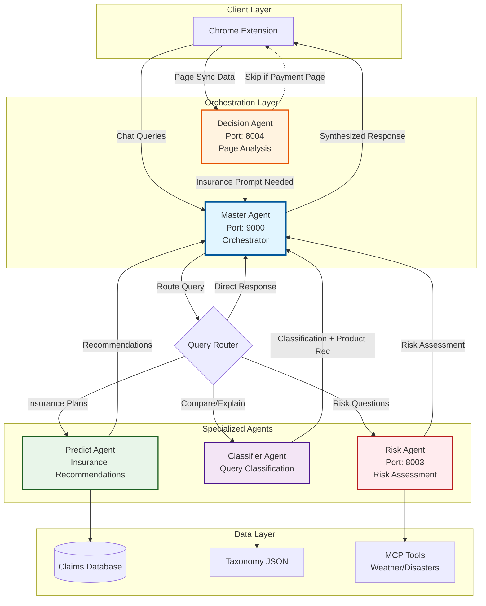
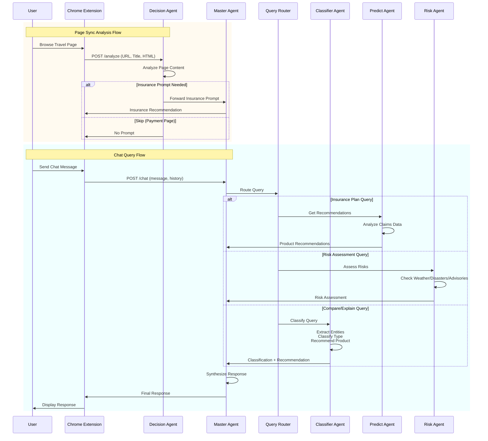
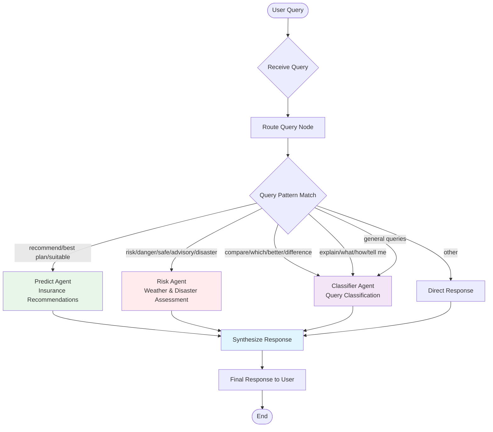
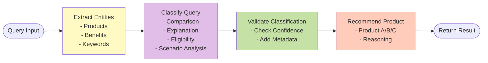
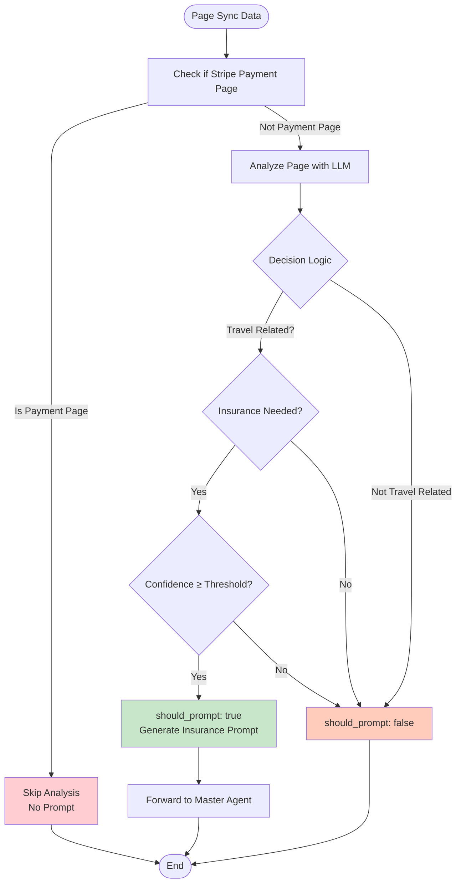
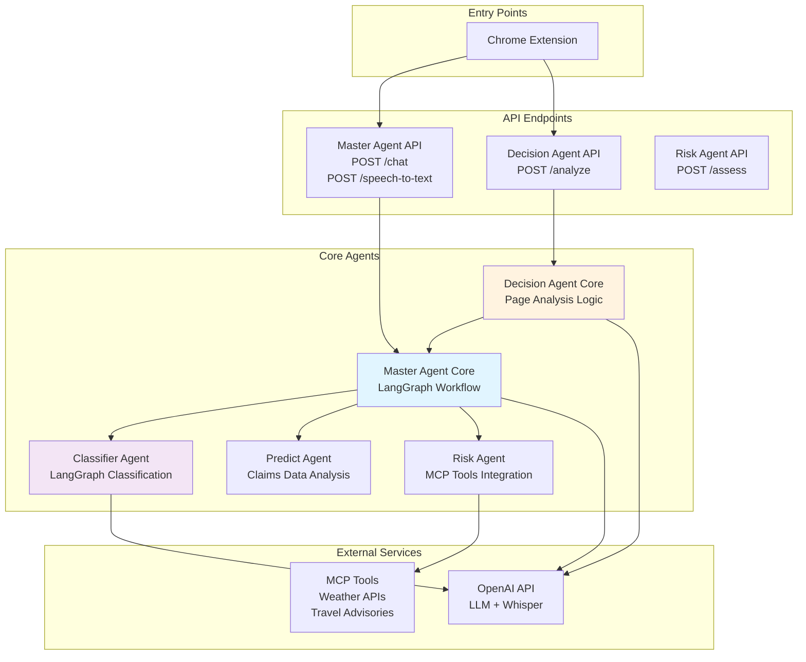
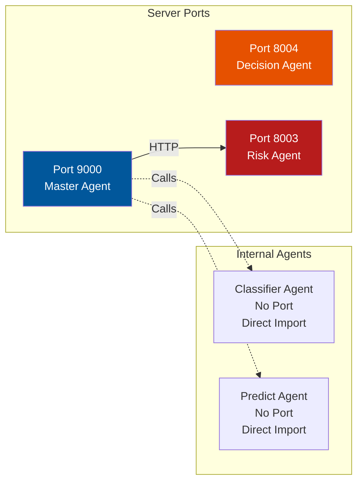
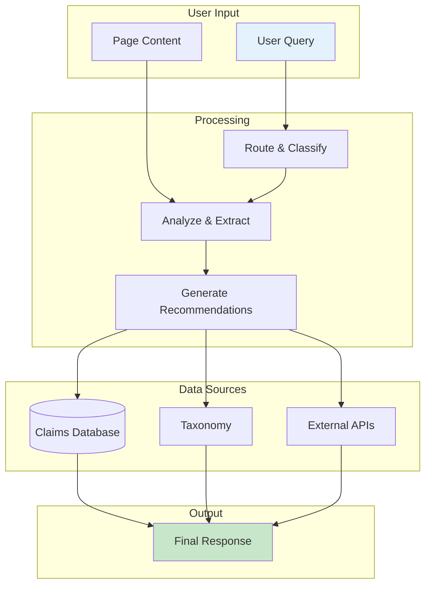

# Agentic Architecture Diagram

This document contains Mermaid diagrams visualizing the agentic design of the SingHack Backend system.

## System Architecture Overview

## Agent Workflow Detail

## Master Agent Routing Logic

## Classifier Agent Workflow

## Decision Agent Analysis Flow

## Component Interaction

## Port Allocation

## Data Flow

